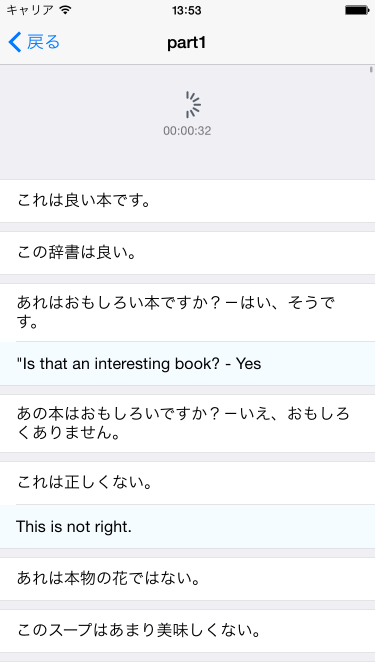

##概要
csvを外部アプリから読み込んで単語帳のように表示するアプリ

~~報酬(お友達価格) : 学食~~

##仕様
csvはコンマ区切りで2列 *{hoge,piyo}* のみ。

読み込み時にはShiftJISでエンコしている。

他のアプリからcsvを開き、**他のアプリで開く**的なのから読み込める。

タイトルなCellを長押しすると名称変更可能。

単語らを表示中は時間計測を行なっており、UIRefreshControlの場所か、振ると確認できる。

